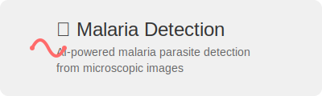
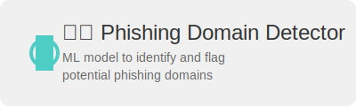

  

# Hello, I'm Pablo de Haro! 👋

Welcome to my GitHub profile. I'm a Data Scientist and AI Specialist passionate about uncovering insights from data and developing innovative AI solutions.

## 🛠 My Skills

- Languages: Python, SQL
- Data Science & ML: TensorFlow, PyTorch, scikit-learn, pandas, NumPy
- Data Visualization: Matplotlib, Seaborn
- Web Applications: Streamlit, Flask
- Cloud Platforms: AWS, Google Cloud Platform
- DevOps & Version Control: Docker, Git
- Development Environment: Jupyter Notebooks, vscode

## 📫 Contact Me

  

## Featured Projects

